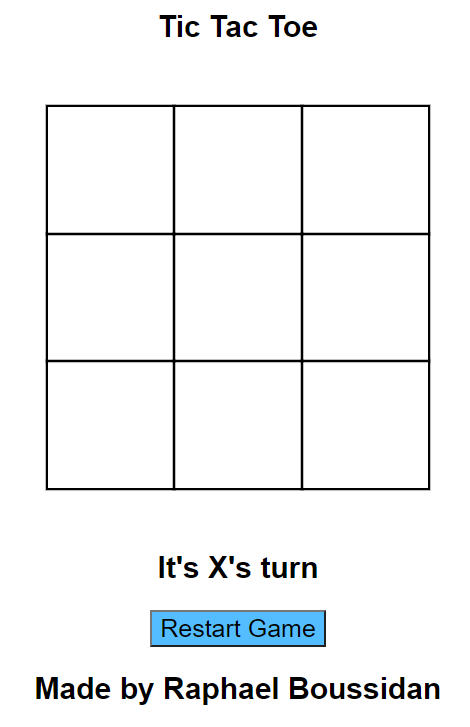

# Hackaton
## Tic tac toe
### by Raphael Boussidan
I made a tic tac toe for the hackaton of Developer Institut.
It takes me 2 days to develop it.
I made a tic tac toe for the hackaton of Developer Institut.
It takes me 2 days to develop it.
 
 
 **HTML**
  - 9 cells for the "o" and "x"
  - Restart button
  
 **JS**
 - Function to get the game status (winner or loser or null)
 - Function to get the player's turn
 - Function to write x or o in cells according to the player
 - Function to restart the game
 
 
 # Capture of the game
 
 
 
 # Demo of the game tic
 
 
